# What a reduction looks like

Every picture and every number on this page is written by [`tools/gallery.py`](../tools/gallery.py), so they describe the reducer as it stands rather than as it once was. Run it again after a change:

```bash
tools/gallery.py
```

Measured on <GLDescription Radeon 8060S Graphics (radeonsi, gfx1151, LLVM 20.1.2, DRM 3.64, 7.0.0-31-generic), 4.6 (Compatibility Profile) Mesa 25.2.8-0ubuntu0.24.04.2 (hardware)>.

Every subject is **CC0**. Credit is given because the work was given away.

- 'Coastal Cliff 04' by Rob Tuytel and Rico Cilliers, from [Poly Haven](https://polyhaven.com/a/coastal_cliff_04), CC0
- 'Lekking ruffs', inventory MP 045, from the Krystyna and Włodzimierz Tomek Natural Science Museum in Ciężkowice, Poland. Digitised by the Regional Digitalisation Lab, Małopolska Institute of Culture in Kraków, for the [Virtual Museums of Małopolska](https://muzea.malopolska.pl/en/objects-list/2250) project, CC0
- 'Coast Land Rocks 02' by Rob Tuytel and Rico Cilliers, from [Poly Haven](https://polyhaven.com/a/coast_land_rocks_02), CC0
- 'Island Tree 03' by Rob Tuytel and Rico Cilliers, from [Poly Haven](https://polyhaven.com/a/island_tree_03), CC0
- 'Marble Bust 01' by Rico Cilliers, from [Poly Haven](https://polyhaven.com/a/marble_bust_01), CC0

## How to read it

Each subject is decimated **once**. Every level below it is a prefix of that one recording replayed, which is why the reduction is counted in seconds and each level in milliseconds -- see [`collapse_sequence`](API.md#collapse_sequenceattributes-indices-optionsnone---collapsesequence).

The chain is the one a game would ship -- 32,000, 8,000, 4,000, 2,000, 1,000, 500 triangles -- rather than a share of whatever the scan happened to arrive with. What a renderer can afford is a count, not a proportion. The source sits above it as a reference: not a level anything would draw, but the picture the rest are judged against.

**Each level is drawn where a renderer would have chosen it.** The rule is screen-space error: a level is placed at the distance where its *measured* deviation from the source projects to **one pixel**, which is what a streaming renderer switches on. A length in model units says nothing about whether anyone can see it; a pixel does.

Three views of each level. **Close up** is the level with the model's own materials and textures, lit by a CC0 studio environment, at 0.25 radii -- the same distance for every level and for the source, so they can be compared with each other. **Where it is used** is the same level at the distance the rule above puts it, in the same frame: how small it is there is the answer, not an accident of framing. **Its triangles** is the level close up again, flat-shaded with its edges on, so what the decimation did is visible beside what it produced.

The **outline** and **shading** figures are the engine's own measurement of the swap where it is drawn: [`pop_breakdown`](../../openglcontext/OpenGLContext/meshlod/quality.py) splits the share of the object's pixels that change into the part whose outline moved and the part that merely shaded differently. The two want different remedies -- a moved outline needs triangles, changed shading needs a normal map baked from the fine mesh -- and one number for both would hide which is happening.

- **`result.error`** is the reducer's own figure: an area-weighted root-mean-square distance to the planes it has been through, not a bound.
- **Measured** is `certify.surface_deviation`, the sampled two-sided Hausdorff distance from the source surface -- the number a switching distance is built on. Both are in the model's own units.
- **Replay** is what `at()` cost to produce that level.
- **Draw** and **frame rate** are the level rendered into a 256 x 256 framebuffer with the geometry resident, timed with `glFinish` around each frame and reported as the median of 90. No swap and no compositor, so the number is what the triangles cost rather than what a monitor allowed. It is one object on an idle card: read the ratios between the rows, not the absolute rate.

Distances are in radii of the model's own bounding sphere, measured beyond its surface: 0.25 is close enough to fill the view, 32 is far enough that the object is a smudge.

## Coastal cliff

A photogrammetry scan of rock. There is no flat region to spend the first million triangles on and no symmetry to exploit: what the reduction keeps is silhouette.

| | |
|---|---|
| Source | 1,537,926 triangles, 789,032 vertices, 1 primitive over 1 material |
| Welded to | 771,255 points |
| Reduced in | 9.5 s, 771,249 contractions |
| Peak process memory | 1548 MB, the loaded model included |
| Credit | 'Coastal Cliff 04' by Rob Tuytel and Rico Cilliers, from [Poly Haven](https://polyhaven.com/a/coastal_cliff_04), CC0 |

| Triangles | Of source | `result.error` | Measured | Replay | Draw | Frame rate | One pixel past | Outline | Shading |
|---:|---:|---:|---:|---:|---:|---:|---:|---:|---:|
| 1,537,926 *(the source, for reference)* | source | 0.00000 | -- | 2247 ms | 0.20 ms | 5,016 | -- | -- | -- |
| 32,000 *(the finest a game would ship)* | 2.1% | 0.04059 | 0.10510 | 90 ms | 0.04 ms | 24,418 | 0.0 r | 0.62% | 54.1% |
| 8,000 | 0.52% | 0.10042 | 0.21058 | 52 ms | 0.04 ms | 24,592 | 0.4 r | 1.37% | 67.5% |
| 4,000 | 0.26% | 0.15330 | 0.48983 | 54 ms | 0.04 ms | 25,330 | 2.4 r | 1.93% | 71.5% |
| 2,000 | 0.13% | 0.23028 | 0.68114 | 43 ms | 0.04 ms | 27,794 | 3.7 r | 3.23% | 69.3% |
| 999 | 0.06% | 0.34224 | 1.19127 | 43 ms | 0.04 ms | 25,878 | 7.2 r | 8.85% | 75.2% |
| 500 *(past here, an imposter)* | 0.03% | 0.49727 | 1.82888 | 42 ms | 0.04 ms | 25,804 | 11.6 r | 10.00% | 80.0% |

<table>
<tr><th align="left">Level</th><th align="left">Close up</th><th align="left">Where it is used</th><th align="left">Its triangles</th></tr>
<tr><td valign="top" width="140"><b>1,537,926</b> tri<br><sub><b>the source, for reference</b><br>the source, drawn where the finest level is</sub></td><td>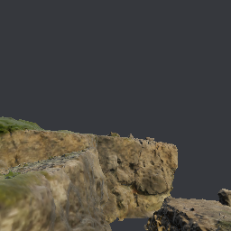</td><td>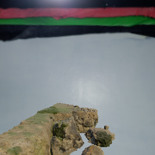</td><td></td></tr>
<tr><td valign="top" width="140"><b>32,000</b> tri<br><sub><b>the finest a game would ship</b><br>one pixel of error past <b>0.0 radii</b><br>drawn there; outline 0.62%, shading 54.1%</sub></td><td></td><td>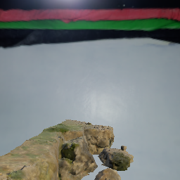</td><td>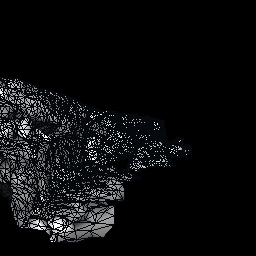</td></tr>
<tr><td valign="top" width="140"><b>8,000</b> tri<br><sub>one pixel of error past <b>0.4 radii</b><br>drawn there; outline 1.37%, shading 67.5%</sub></td><td>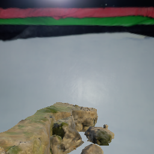</td><td>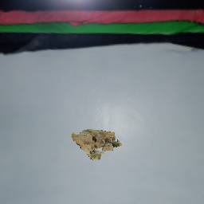</td><td>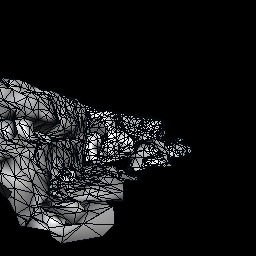</td></tr>
<tr><td valign="top" width="140"><b>4,000</b> tri<br><sub>one pixel of error past <b>2.4 radii</b><br>drawn there; outline 1.93%, shading 71.5%</sub></td><td>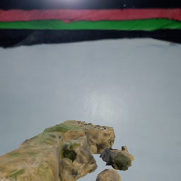</td><td>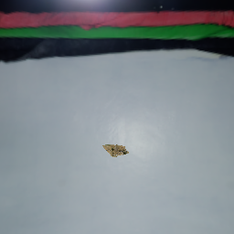</td><td>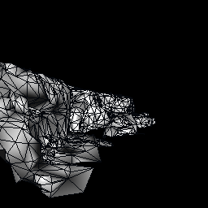</td></tr>
<tr><td valign="top" width="140"><b>2,000</b> tri<br><sub>one pixel of error past <b>3.7 radii</b><br>drawn there; outline 3.23%, shading 69.3%</sub></td><td>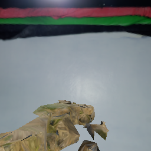</td><td>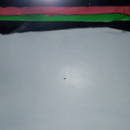</td><td>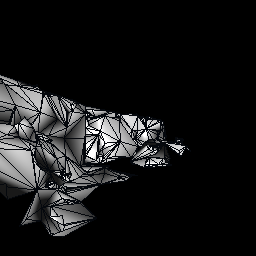</td></tr>
<tr><td valign="top" width="140"><b>999</b> tri<br><sub>one pixel of error past <b>7.2 radii</b><br>drawn there; outline 8.85%, shading 75.2%</sub></td><td>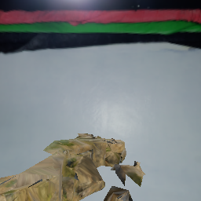</td><td></td><td>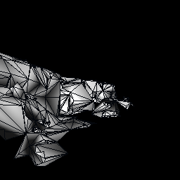</td></tr>
<tr><td valign="top" width="140"><b>500</b> tri<br><sub><b>past here, an imposter</b><br>one pixel of error past <b>11.6 radii</b><br>drawn there; outline 10.00%, shading 80.0%</sub></td><td>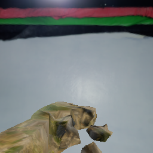</td><td>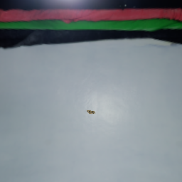</td><td>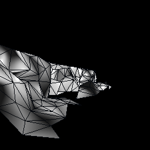</td></tr>
</table>

## Lekking ruffs

A museum scan exported as twenty-five primitives, each stopping at the 65,535 vertices a 16-bit index can name -- so the reduction sees one surface only because the primitives are merged and welded first. Nine of its thirteen components are specks the photogrammetry left behind, and `drop_components_below` takes them: 572 triangles, which is fifteen per cent of what the coarsest rung has to spend. What it cannot take is the reason this chain stops at all -- see **Where a chain stops** below.

| | |
|---|---|
| Source | 547,647 triangles, 1,601,690 vertices, 25 primitives over 2 materials |
| Welded to | 273,414 points |
| Reduced in | 4.2 s, 271,735 contractions |
| Peak process memory | 17278 MB, the loaded model included |
| Floor | 3,614 triangles, where no contraction is left that keeps the surface a surface |
| Credit | 'Lekking ruffs', inventory MP 045, from the Krystyna and Włodzimierz Tomek Natural Science Museum in Ciężkowice, Poland. Digitised by the Regional Digitalisation Lab, Małopolska Institute of Culture in Kraków, for the [Virtual Museums of Małopolska](https://muzea.malopolska.pl/en/objects-list/2250) project, CC0 |

| Triangles | Of source | `result.error` | Measured | Replay | Draw | Frame rate | One pixel past | Outline | Shading |
|---:|---:|---:|---:|---:|---:|---:|---:|---:|---:|
| 547,075 *(the source, for reference)* | source | 0.00000 | -- | 950 ms | 0.21 ms | 4,855 | -- | -- | -- |
| 32,000 *(the finest a game would ship)* | 5.8% | 0.00120 | 0.00542 | 70 ms | 0.06 ms | 16,306 | 3.3 r | 1.57% | 58.0% |
| 8,000 | 1.5% | 0.00452 | 0.02933 | 29 ms | 0.04 ms | 25,705 | 22.1 r | 4.44% | 60.7% |
| 4,542 | 0.83% | 0.05172 | 0.07872 | 23 ms | 0.04 ms | 26,158 | 60.9 r | 11.29% | 66.1% |
| 3,614 | 0.66% | 0.05172 | 0.14003 | 22 ms | 0.04 ms | 24,299 | 109.1 r | 17.74% | 71.0% |

<table>
<tr><th align="left">Level</th><th align="left">Close up</th><th align="left">Where it is used</th><th align="left">Its triangles</th></tr>
<tr><td valign="top" width="140"><b>547,075</b> tri<br><sub><b>the source, for reference</b><br>the source, drawn where the finest level is</sub></td><td></td><td></td><td>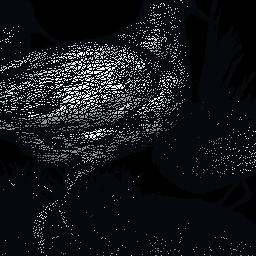</td></tr>
<tr><td valign="top" width="140"><b>32,000</b> tri<br><sub><b>the finest a game would ship</b><br>one pixel of error past <b>3.3 radii</b><br>drawn there; outline 1.57%, shading 58.0%</sub></td><td></td><td></td><td>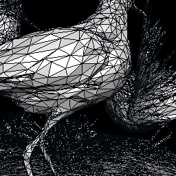</td></tr>
<tr><td valign="top" width="140"><b>8,000</b> tri<br><sub>one pixel of error past <b>22.1 radii</b><br>drawn there; outline 4.44%, shading 60.7%</sub></td><td></td><td></td><td>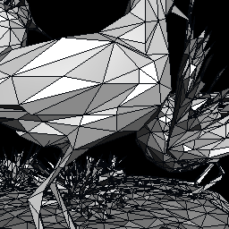</td></tr>
<tr><td valign="top" width="140"><b>4,542</b> tri<br><sub>one pixel of error past <b>60.9 radii</b><br>drawn there; outline 11.29%, shading 66.1%</sub></td><td></td><td></td><td>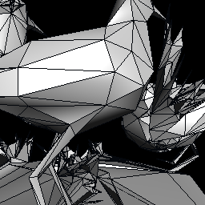</td></tr>
<tr><td valign="top" width="140"><b>3,614</b> tri<br><sub>one pixel of error past <b>109.1 radii</b><br>drawn there; outline 17.74%, shading 71.0%</sub></td><td></td><td></td><td>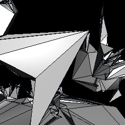</td></tr>
</table>

## Coastal land rocks

Several separate boulders in one mesh, so the reduction has to spend across them.

| | |
|---|---|
| Source | 1,291,146 triangles, 662,707 vertices, 1 primitive over 1 material |
| Welded to | 647,007 points |
| Reduced in | 8.1 s, 646,979 contractions |
| Peak process memory | 17278 MB, the loaded model included |
| Credit | 'Coast Land Rocks 02' by Rob Tuytel and Rico Cilliers, from [Poly Haven](https://polyhaven.com/a/coast_land_rocks_02), CC0 |

| Triangles | Of source | `result.error` | Measured | Replay | Draw | Frame rate | One pixel past | Outline | Shading |
|---:|---:|---:|---:|---:|---:|---:|---:|---:|---:|
| 1,291,146 *(the source, for reference)* | source | 0.00000 | -- | 2682 ms | 0.17 ms | 5,892 | -- | -- | -- |
| 32,000 *(the finest a game would ship)* | 2.5% | 0.00981 | 0.02428 | 81 ms | 0.04 ms | 23,653 | 0.4 r | 0.93% | 59.1% |
| 7,999 | 0.62% | 0.02303 | 0.05760 | 44 ms | 0.04 ms | 26,111 | 2.4 r | 3.51% | 70.6% |
| 3,999 | 0.31% | 0.03422 | 0.07442 | 38 ms | 0.04 ms | 25,315 | 3.4 r | 4.99% | 72.5% |
| 1,999 | 0.15% | 0.04964 | 0.13543 | 35 ms | 0.04 ms | 26,732 | 7.0 r | 9.57% | 71.8% |
| 999 | 0.08% | 0.07210 | 0.19508 | 33 ms | 0.04 ms | 27,050 | 10.5 r | 11.83% | 69.9% |
| 500 *(past here, an imposter)* | 0.04% | 0.10611 | 0.31521 | 32 ms | 0.05 ms | 18,935 | 17.5 r | 12.50% | 75.0% |

<table>
<tr><th align="left">Level</th><th align="left">Close up</th><th align="left">Where it is used</th><th align="left">Its triangles</th></tr>
<tr><td valign="top" width="140"><b>1,291,146</b> tri<br><sub><b>the source, for reference</b><br>the source, drawn where the finest level is</sub></td><td>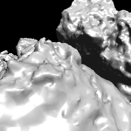</td><td>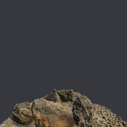</td><td>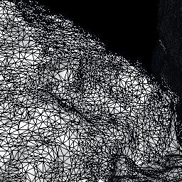</td></tr>
<tr><td valign="top" width="140"><b>32,000</b> tri<br><sub><b>the finest a game would ship</b><br>one pixel of error past <b>0.4 radii</b><br>drawn there; outline 0.93%, shading 59.1%</sub></td><td></td><td>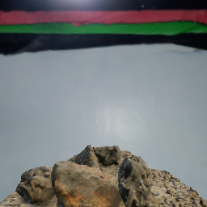</td><td>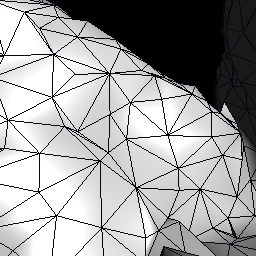</td></tr>
<tr><td valign="top" width="140"><b>7,999</b> tri<br><sub>one pixel of error past <b>2.4 radii</b><br>drawn there; outline 3.51%, shading 70.6%</sub></td><td>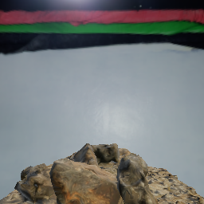</td><td>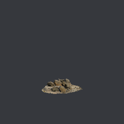</td><td>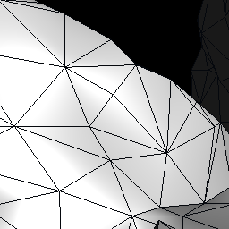</td></tr>
<tr><td valign="top" width="140"><b>3,999</b> tri<br><sub>one pixel of error past <b>3.4 radii</b><br>drawn there; outline 4.99%, shading 72.5%</sub></td><td>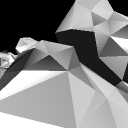</td><td>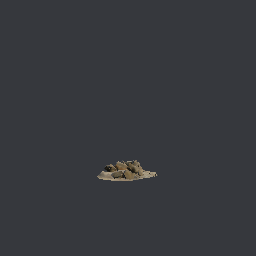</td><td>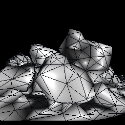</td></tr>
<tr><td valign="top" width="140"><b>1,999</b> tri<br><sub>one pixel of error past <b>7.0 radii</b><br>drawn there; outline 9.57%, shading 71.8%</sub></td><td>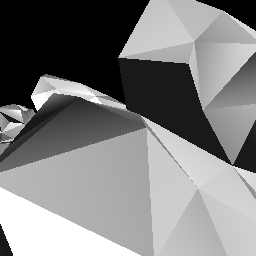</td><td>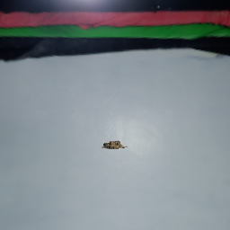</td><td>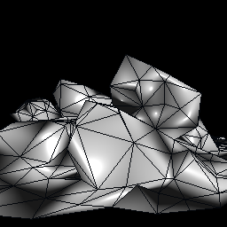</td></tr>
<tr><td valign="top" width="140"><b>999</b> tri<br><sub>one pixel of error past <b>10.5 radii</b><br>drawn there; outline 11.83%, shading 69.9%</sub></td><td>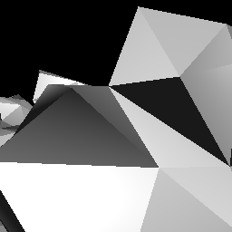</td><td></td><td>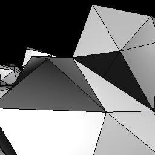</td></tr>
<tr><td valign="top" width="140"><b>500</b> tri<br><sub><b>past here, an imposter</b><br>one pixel of error past <b>17.5 radii</b><br>drawn there; outline 12.50%, shading 75.0%</sub></td><td>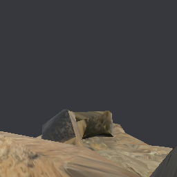</td><td></td><td>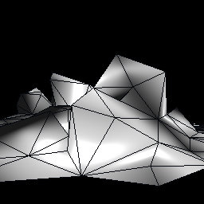</td></tr>
</table>

## Island tree

The hard case. A canopy of alpha-cut leaf cards barely welds at all -- 2,085,320 triangles over 1,598,940 points -- because almost no two cards share a vertex, and a card cannot be reduced below the triangles that carry its cutout.

| | |
|---|---|
| Source | 2,085,320 triangles, 1,708,346 vertices, 3 primitives over 3 materials |
| Welded to | 1,598,940 points |
| Reduced in | 9.8 s, 1,454,992 contractions |
| Peak process memory | 17278 MB, the loaded model included |
| Credit | 'Island Tree 03' by Rob Tuytel and Rico Cilliers, from [Poly Haven](https://polyhaven.com/a/island_tree_03), CC0 |

| Triangles | Of source | `result.error` | Measured | Replay | Draw | Frame rate | One pixel past | Outline | Shading |
|---:|---:|---:|---:|---:|---:|---:|---:|---:|---:|
| 2,085,320 *(the source, for reference)* | source | 0.00000 | -- | 1637 ms | 0.34 ms | 2,982 | -- | -- | -- |
| 31,999 *(the finest a game would ship)* | 1.5% | 0.01902 | 0.23840 | 96 ms | 0.04 ms | 23,069 | 34.9 r | 35.58% | 41.1% |
| 13,978 | 0.67% | 0.12872 | 0.87611 | 81 ms | 0.04 ms | 24,463 | 131.0 r | 46.34% | 41.5% |
| 11,260 | 0.54% | 0.20494 | 1.16178 | 78 ms | 0.04 ms | 24,583 | 174.1 r | 51.16% | 39.5% |
| 9,909 | 0.48% | 0.20494 | 1.55414 | 79 ms | 0.04 ms | 25,279 | 233.2 r | 55.81% | 34.9% |
| 9,234 | 0.44% | 0.20494 | 1.68257 | 77 ms | 0.04 ms | 26,854 | 252.6 r | 55.81% | 37.2% |
| 8,896 *(past here, an imposter)* | 0.43% | 0.20494 | 1.71440 | 78 ms | 0.04 ms | 25,298 | 257.4 r | 58.14% | 34.9% |

<table>
<tr><th align="left">Level</th><th align="left">Close up</th><th align="left">Where it is used</th><th align="left">Its triangles</th></tr>
<tr><td valign="top" width="140"><b>2,085,320</b> tri<br><sub><b>the source, for reference</b><br>the source, drawn where the finest level is</sub></td><td></td><td>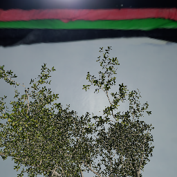</td><td>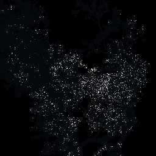</td></tr>
<tr><td valign="top" width="140"><b>31,999</b> tri<br><sub><b>the finest a game would ship</b><br>one pixel of error past <b>34.9 radii</b><br>drawn there; outline 35.58%, shading 41.1%</sub></td><td></td><td>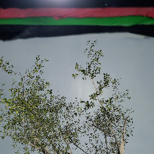</td><td></td></tr>
<tr><td valign="top" width="140"><b>13,978</b> tri<br><sub>one pixel of error past <b>131.0 radii</b><br>drawn there; outline 46.34%, shading 41.5%</sub></td><td>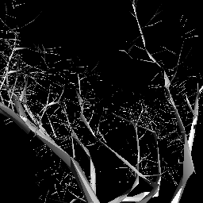</td><td></td><td>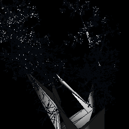</td></tr>
<tr><td valign="top" width="140"><b>11,260</b> tri<br><sub>one pixel of error past <b>174.1 radii</b><br>drawn there; outline 51.16%, shading 39.5%</sub></td><td>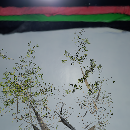</td><td></td><td>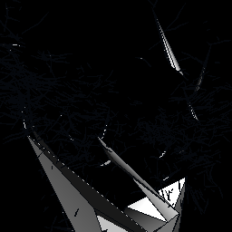</td></tr>
<tr><td valign="top" width="140"><b>9,909</b> tri<br><sub>one pixel of error past <b>233.2 radii</b><br>drawn there; outline 55.81%, shading 34.9%</sub></td><td>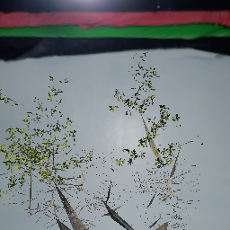</td><td></td><td>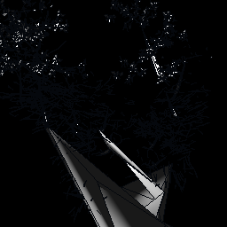</td></tr>
<tr><td valign="top" width="140"><b>9,234</b> tri<br><sub>one pixel of error past <b>252.6 radii</b><br>drawn there; outline 55.81%, shading 37.2%</sub></td><td></td><td></td><td></td></tr>
<tr><td valign="top" width="140"><b>8,896</b> tri<br><sub><b>past here, an imposter</b><br>one pixel of error past <b>257.4 radii</b><br>drawn there; outline 58.14%, shading 34.9%</sub></td><td></td><td></td><td></td></tr>
</table>

## Marble bust

Small enough to read every triangle, and a face is where an error is obvious.

| | |
|---|---|
| Source | 17,456 triangles, 9,746 vertices, 1 primitive over 1 material |
| Welded to | 8,730 points |
| Reduced in | 0.0 s, 8,726 contractions |
| Peak process memory | 17278 MB, the loaded model included |
| Credit | 'Marble Bust 01' by Rico Cilliers, from [Poly Haven](https://polyhaven.com/a/marble_bust_01), CC0 |

| Triangles | Of source | `result.error` | Measured | Replay | Draw | Frame rate | One pixel past | Outline | Shading |
|---:|---:|---:|---:|---:|---:|---:|---:|---:|---:|
| 17,456 *(the source, for reference)* | source | 0.00000 | -- | 18 ms | 0.04 ms | 24,496 | -- | -- | -- |
| 8,000 *(the finest a game would ship)* | 45.8% | 0.00026 | 0.00074 | 9 ms | 0.04 ms | 24,904 | 0.0 r | 0.04% | 4.9% |
| 4,000 | 22.9% | 0.00055 | 0.00153 | 5 ms | 0.04 ms | 24,193 | 0.7 r | 0.24% | 14.7% |
| 2,000 | 11.5% | 0.00098 | 0.00427 | 3 ms | 0.04 ms | 27,006 | 3.8 r | 0.62% | 23.9% |
| 1,000 | 5.7% | 0.00172 | 0.00468 | 2 ms | 0.04 ms | 27,182 | 4.2 r | 1.51% | 36.0% |
| 500 *(past here, an imposter)* | 2.9% | 0.00292 | 0.00940 | 4 ms | 0.04 ms | 25,029 | 9.5 r | 1.92% | 47.3% |

<table>
<tr><th align="left">Level</th><th align="left">Close up</th><th align="left">Where it is used</th><th align="left">Its triangles</th></tr>
<tr><td valign="top" width="140"><b>17,456</b> tri<br><sub><b>the source, for reference</b><br>the source, drawn where the finest level is</sub></td><td></td><td></td><td></td></tr>
<tr><td valign="top" width="140"><b>8,000</b> tri<br><sub><b>the finest a game would ship</b><br>one pixel of error past <b>0.0 radii</b><br>drawn there; outline 0.04%, shading 4.9%</sub></td><td></td><td></td><td></td></tr>
<tr><td valign="top" width="140"><b>4,000</b> tri<br><sub>one pixel of error past <b>0.7 radii</b><br>drawn there; outline 0.24%, shading 14.7%</sub></td><td></td><td></td><td></td></tr>
<tr><td valign="top" width="140"><b>2,000</b> tri<br><sub>one pixel of error past <b>3.8 radii</b><br>drawn there; outline 0.62%, shading 23.9%</sub></td><td></td><td></td><td></td></tr>
<tr><td valign="top" width="140"><b>1,000</b> tri<br><sub>one pixel of error past <b>4.2 radii</b><br>drawn there; outline 1.51%, shading 36.0%</sub></td><td></td><td></td><td></td></tr>
<tr><td valign="top" width="140"><b>500</b> tri<br><sub><b>past here, an imposter</b><br>one pixel of error past <b>9.5 radii</b><br>drawn there; outline 1.92%, shading 47.3%</sub></td><td></td><td></td><td></td></tr>
</table>

