# What a reduction looks like

Every picture and every number on this page is written by [`tools/gallery.py`](../tools/gallery.py), so they describe the reducer as it stands rather than as it once was. Run it again after a change:

```bash
tools/gallery.py
```

Measured on <GLDescription Radeon 8060S Graphics (radeonsi, gfx1151, LLVM 20.1.2, DRM 3.64, 7.0.0-31-generic), 4.6 (Compatibility Profile) Mesa 25.2.8-0ubuntu0.24.04.2 (hardware)>.

Every subject is **CC0**. Credit is given because the work was given away.

- 'Coastal Cliff 04' by Rob Tuytel and Rico Cilliers, from [Poly Haven](https://polyhaven.com/a/coastal_cliff_04), CC0
- 'Lekking ruffs', inventory MP 045, from the Krystyna and Włodzimierz Tomek Natural Science Museum in Ciężkowice, Poland. Digitised by the Regional Digitalisation Lab, Małopolska Institute of Culture in Kraków, for the [Virtual Museums of Małopolska](https://muzea.malopolska.pl/en/objects-list/2250) project, CC0
- 'Coast Land Rocks 02' by Rob Tuytel and Rico Cilliers, from [Poly Haven](https://polyhaven.com/a/coast_land_rocks_02), CC0
- 'Island Tree 03' by Rob Tuytel and Rico Cilliers, from [Poly Haven](https://polyhaven.com/a/island_tree_03), CC0
- 'Marble Bust 01' by Rico Cilliers, from [Poly Haven](https://polyhaven.com/a/marble_bust_01), CC0

## How to read it

Each subject is decimated **once**. Every level below it is a prefix of that one recording replayed, which is why the reduction is counted in seconds and each level in milliseconds -- see [`collapse_sequence`](API.md#collapse_sequenceattributes-indices-optionsnone---collapsesequence).

The chain each subject is cut into is the one a renderer wants rather than an even split of the source. The **source** stays at the top: it is the level to swap in when somebody walks up to the thing and looks into the crevices, and nothing coarser can serve that. Below it, **10,000 triangles** is what an ordinary finest level can afford when there is a world to draw as well, and the rungs walk from there down to **120**, past which an imposter costs less than any mesh.

- **`result.error`** is the reducer's own figure: an area-weighted root-mean-square distance to the planes it has been through, not a bound.
- **Measured** is `certify.surface_deviation`, the sampled two-sided Hausdorff distance from the source surface -- the number a switching distance is built on. Both are in the model's own units.
- **Replay** is what `at()` cost to produce that level.
- **Draw** and **frame rate** are the level rendered into a 256 x 256 framebuffer with the geometry resident, timed with `glFinish` around each frame and reported as the median of 90. No swap and no compositor, so the number is what the triangles cost rather than what a monitor allowed. It is one object on an idle card: read the ratios between the rows, not the absolute rate.

The distance sheets put the camera from 1.02 to 40 radii of the model's own bounding sphere away from its centre -- 1.02 being as close as a view of the whole object gets. The rightmost column is the object at the size it covers when a renderer is deciding whether anyone would notice, and the point of the sheet is how far left you have to read before the rows stop agreeing.

## Coastal cliff

A photogrammetry scan of rock. There is no flat region to spend the first million triangles on and no symmetry to exploit: what the reduction keeps is silhouette.

| | |
|---|---|
| Source | 1,537,926 triangles, 789,032 vertices, 1 primitive |
| Welded to | 771,255 points |
| Reduced in | 9.3 s, 771,249 contractions |
| Peak process memory | 1417 MB, the loaded model included |
| Credit | 'Coastal Cliff 04' by Rob Tuytel and Rico Cilliers, from [Poly Haven](https://polyhaven.com/a/coastal_cliff_04), CC0 |

| Level | Triangles | Of source | `result.error` | Measured | Replay | Draw | Frame rate | |
|---|---:|---:|---:|---:|---:|---:|---:|---|
| 0 | 1,537,926 | source | 0.00000 | -- | 2015 ms | 0.19 ms | 5,207 | **walk up to it** |
| 1 | 124,013 | 8.1% | 0.01531 | 0.06977 | 200 ms | 0.07 ms | 13,634 |  |
| 2 | 9,999 | 0.65% | 0.08702 | 0.20650 | 54 ms | 0.04 ms | 24,907 | **a game's ordinary finest** |
| 3 | 4,784 | 0.31% | 0.13767 | 0.45489 | 46 ms | 0.04 ms | 25,459 |  |
| 4 | 2,289 | 0.15% | 0.21386 | 0.68105 | 58 ms | 0.05 ms | 18,703 |  |
| 5 | 1,094 | 0.07% | 0.32652 | 1.19127 | 41 ms | 0.04 ms | 24,217 |  |
| 6 | 523 | 0.03% | 0.49029 | 1.66595 | 41 ms | 0.04 ms | 25,184 |  |
| 7 | 251 | 0.02% | 0.70594 | 3.11264 | 43 ms | 0.04 ms | 25,560 |  |
| 8 | 119 | 0.01% | 1.03028 | 4.21342 | 48 ms | 0.04 ms | 25,257 | **past here, an imposter** |

### What it looks like

<table><tr><td align="center"><br><sub><b>1,537,926</b> tri<br>walk up to it</sub></td><td align="center"><br><sub><b>124,013</b> tri</sub></td><td align="center"><br><sub><b>9,999</b> tri<br>a game's ordinary finest</sub></td><td align="center"><br><sub><b>4,784</b> tri</sub></td><td align="center"><br><sub><b>2,289</b> tri</sub></td><td align="center"><br><sub><b>1,094</b> tri</sub></td><td align="center"><br><sub><b>523</b> tri</sub></td><td align="center">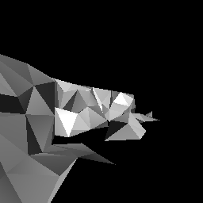<br><sub><b>251</b> tri</sub></td><td align="center">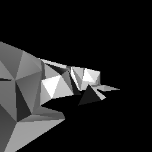<br><sub><b>119</b> tri<br>past here, an imposter</sub></td></tr></table>

<details><summary>and the triangles producing it</summary>

<table><tr><td align="center"><br><sub><b>1,537,926</b> tri<br>walk up to it</sub></td><td align="center"><br><sub><b>124,013</b> tri</sub></td><td align="center"><br><sub><b>9,999</b> tri<br>a game's ordinary finest</sub></td><td align="center"><br><sub><b>4,784</b> tri</sub></td><td align="center"><br><sub><b>2,289</b> tri</sub></td><td align="center"><br><sub><b>1,094</b> tri</sub></td><td align="center"><br><sub><b>523</b> tri</sub></td><td align="center">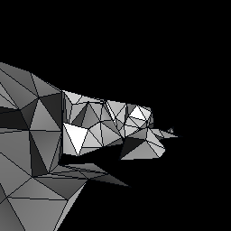<br><sub><b>251</b> tri</sub></td><td align="center">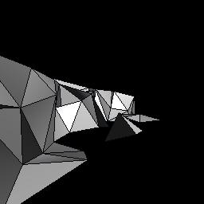<br><sub><b>119</b> tri<br>past here, an imposter</sub></td></tr></table>

</details>

### Close to barely visible

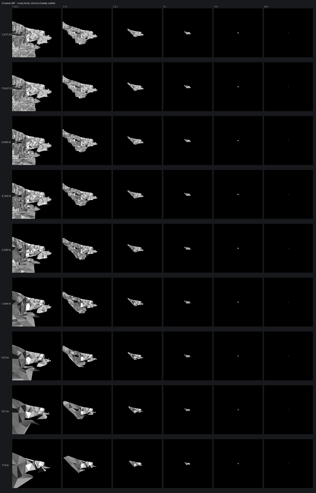

## Lekking ruffs

A museum scan exported as twenty-five primitives, each stopping at the 65,535 vertices a 16-bit index can name -- so the reduction sees one surface only because the primitives are merged and welded first. It is also 664 separate shells: the birds, and hundreds of specks the photogrammetry left behind. Each shell has a floor of its own, which is why this chain stops where it does rather than at the coarsest rung.

| | |
|---|---|
| Source | 547,647 triangles, 1,601,690 vertices, 25 primitives |
| Welded to | 273,414 points |
| Reduced in | 3.7 s, 271,926 contractions |
| Peak process memory | 17096 MB, the loaded model included |
| Floor | 3,804 triangles, where no contraction is left that keeps the surface a surface |
| Credit | 'Lekking ruffs', inventory MP 045, from the Krystyna and Włodzimierz Tomek Natural Science Museum in Ciężkowice, Poland. Digitised by the Regional Digitalisation Lab, Małopolska Institute of Culture in Kraków, for the [Virtual Museums of Małopolska](https://muzea.malopolska.pl/en/objects-list/2250) project, CC0 |

| Level | Triangles | Of source | `result.error` | Measured | Replay | Draw | Frame rate | |
|---|---:|---:|---:|---:|---:|---:|---:|---|
| 0 | 547,647 | source | 0.00000 | -- | 876 ms | 0.24 ms | 4,140 | **walk up to it** |
| 1 | 74,002 | 13.5% | 0.00044 | 0.00143 | 173 ms | 0.08 ms | 12,302 |  |
| 2 | 10,000 | 1.8% | 0.00197 | 0.01286 | 30 ms | 0.04 ms | 25,356 | **a game's ordinary finest** |
| 3 | 4,784 | 0.87% | 0.00493 | 0.04386 | 23 ms | 0.04 ms | 24,704 |  |
| 4 | 3,804 | 0.69% | 0.05172 | 0.12295 | 22 ms | 0.04 ms | 24,812 |  |

### What it looks like

<table><tr><td align="center"><br><sub><b>547,647</b> tri<br>walk up to it</sub></td><td align="center"><br><sub><b>74,002</b> tri</sub></td><td align="center">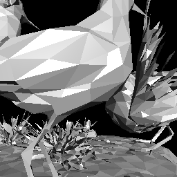<br><sub><b>10,000</b> tri<br>a game's ordinary finest</sub></td><td align="center">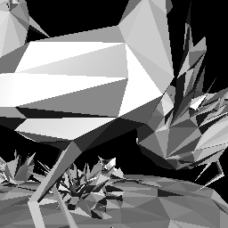<br><sub><b>4,784</b> tri</sub></td><td align="center">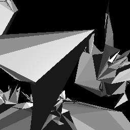<br><sub><b>3,804</b> tri</sub></td></tr></table>

<details><summary>and the triangles producing it</summary>

<table><tr><td align="center"><br><sub><b>547,647</b> tri<br>walk up to it</sub></td><td align="center"><br><sub><b>74,002</b> tri</sub></td><td align="center"><br><sub><b>10,000</b> tri<br>a game's ordinary finest</sub></td><td align="center"><br><sub><b>4,784</b> tri</sub></td><td align="center"><br><sub><b>3,804</b> tri</sub></td></tr></table>

</details>

### Close to barely visible

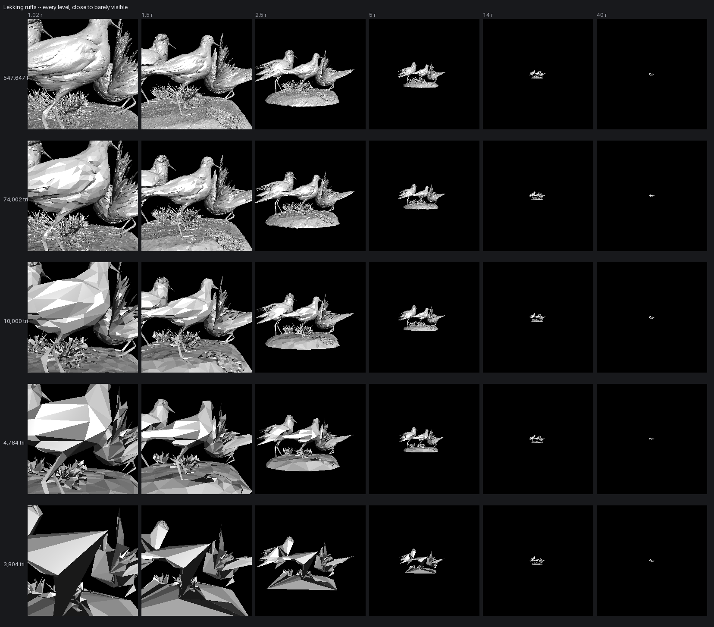

## Coastal land rocks

Several separate boulders in one mesh, so the reduction has to spend across them.

| | |
|---|---|
| Source | 1,291,146 triangles, 662,707 vertices, 1 primitive |
| Welded to | 647,007 points |
| Reduced in | 8.0 s, 646,979 contractions |
| Peak process memory | 17096 MB, the loaded model included |
| Credit | 'Coast Land Rocks 02' by Rob Tuytel and Rico Cilliers, from [Poly Haven](https://polyhaven.com/a/coast_land_rocks_02), CC0 |

| Level | Triangles | Of source | `result.error` | Measured | Replay | Draw | Frame rate | |
|---|---:|---:|---:|---:|---:|---:|---:|---|
| 0 | 1,291,146 | source | 0.00000 | -- | 2149 ms | 0.17 ms | 5,865 | **walk up to it** |
| 1 | 113,629 | 8.8% | 0.00394 | 0.00836 | 176 ms | 0.06 ms | 15,724 |  |
| 2 | 9,999 | 0.77% | 0.02023 | 0.04056 | 44 ms | 0.04 ms | 24,065 | **a game's ordinary finest** |
| 3 | 4,784 | 0.37% | 0.03094 | 0.06941 | 37 ms | 0.04 ms | 24,547 |  |
| 4 | 2,289 | 0.18% | 0.04577 | 0.11379 | 34 ms | 0.04 ms | 24,279 |  |
| 5 | 1,094 | 0.08% | 0.06821 | 0.19508 | 32 ms | 0.04 ms | 25,250 |  |
| 6 | 523 | 0.04% | 0.10376 | 0.31050 | 32 ms | 0.04 ms | 25,672 |  |
| 7 | 251 | 0.02% | 0.15377 | 0.52561 | 31 ms | 0.04 ms | 22,342 |  |
| 8 | 120 | 0.01% | 0.25041 | 0.80929 | 32 ms | 0.04 ms | 25,665 | **past here, an imposter** |

### What it looks like

<table><tr><td align="center"><br><sub><b>1,291,146</b> tri<br>walk up to it</sub></td><td align="center"><br><sub><b>113,629</b> tri</sub></td><td align="center"><br><sub><b>9,999</b> tri<br>a game's ordinary finest</sub></td><td align="center"><br><sub><b>4,784</b> tri</sub></td><td align="center"><br><sub><b>2,289</b> tri</sub></td><td align="center"><br><sub><b>1,094</b> tri</sub></td><td align="center"><br><sub><b>523</b> tri</sub></td><td align="center">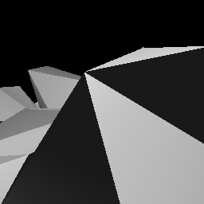<br><sub><b>251</b> tri</sub></td><td align="center"><br><sub><b>120</b> tri<br>past here, an imposter</sub></td></tr></table>

<details><summary>and the triangles producing it</summary>

<table><tr><td align="center"><br><sub><b>1,291,146</b> tri<br>walk up to it</sub></td><td align="center"><br><sub><b>113,629</b> tri</sub></td><td align="center"><br><sub><b>9,999</b> tri<br>a game's ordinary finest</sub></td><td align="center"><br><sub><b>4,784</b> tri</sub></td><td align="center"><br><sub><b>2,289</b> tri</sub></td><td align="center"><br><sub><b>1,094</b> tri</sub></td><td align="center"><br><sub><b>523</b> tri</sub></td><td align="center">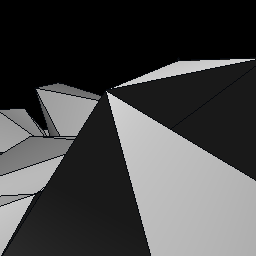<br><sub><b>251</b> tri</sub></td><td align="center">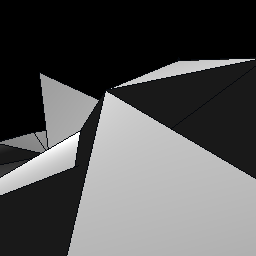<br><sub><b>120</b> tri<br>past here, an imposter</sub></td></tr></table>

</details>

### Close to barely visible

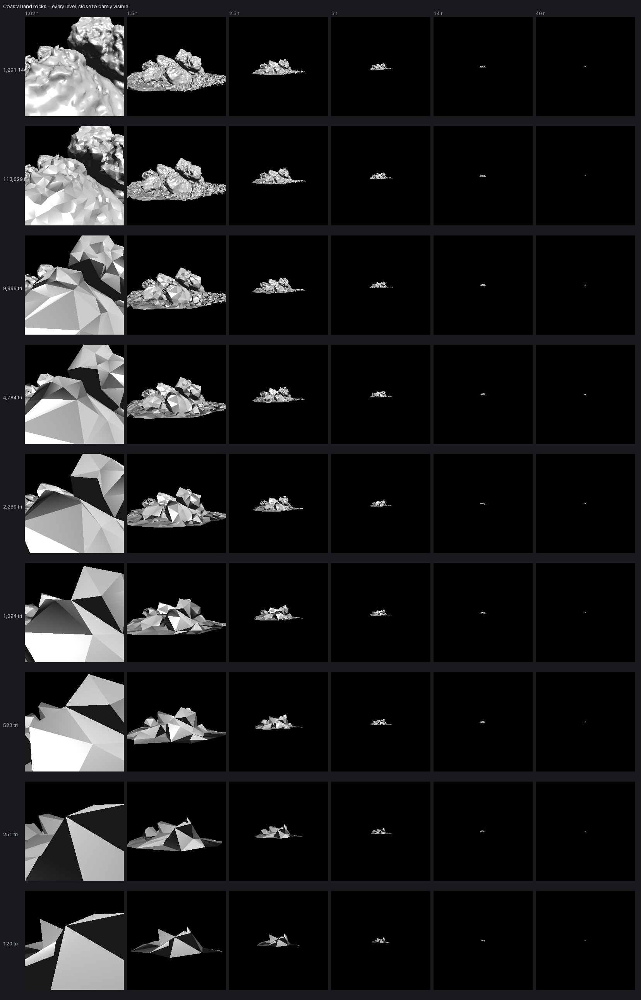

## Island tree

The hard case. A canopy of alpha-cut leaf cards barely welds at all -- 2,085,320 triangles over 1,598,940 points -- because almost no two cards share a vertex, and a card cannot be reduced below the triangles that carry its cutout.

| | |
|---|---|
| Source | 2,085,320 triangles, 1,708,346 vertices, 3 primitives |
| Welded to | 1,598,940 points |
| Reduced in | 11.3 s, 1,454,992 contractions |
| Peak process memory | 17096 MB, the loaded model included |
| Floor | 8,558 triangles, where no contraction is left that keeps the surface a surface |
| Credit | 'Island Tree 03' by Rob Tuytel and Rico Cilliers, from [Poly Haven](https://polyhaven.com/a/island_tree_03), CC0 |

| Level | Triangles | Of source | `result.error` | Measured | Replay | Draw | Frame rate | |
|---|---:|---:|---:|---:|---:|---:|---:|---|
| 0 | 2,085,320 | source | 0.00000 | -- | 1339 ms | 0.33 ms | 3,064 | **walk up to it** |
| 1 | 144,406 | 6.9% | 0.00221 | 0.02001 | 157 ms | 0.08 ms | 12,846 |  |
| 2 | 10,000 | 0.48% | 0.01202 | 0.14767 | 82 ms | 0.04 ms | 26,016 | **a game's ordinary finest** |
| 3 | 8,558 | 0.41% | 0.20494 | 0.49845 | 81 ms | 0.04 ms | 26,127 |  |

### What it looks like

<table><tr><td align="center"><br><sub><b>2,085,320</b> tri<br>walk up to it</sub></td><td align="center"><br><sub><b>144,406</b> tri</sub></td><td align="center"><br><sub><b>10,000</b> tri<br>a game's ordinary finest</sub></td><td align="center"><br><sub><b>8,558</b> tri</sub></td></tr></table>

<details><summary>and the triangles producing it</summary>

<table><tr><td align="center"><br><sub><b>2,085,320</b> tri<br>walk up to it</sub></td><td align="center"><br><sub><b>144,406</b> tri</sub></td><td align="center"><br><sub><b>10,000</b> tri<br>a game's ordinary finest</sub></td><td align="center"><br><sub><b>8,558</b> tri</sub></td></tr></table>

</details>

### Close to barely visible

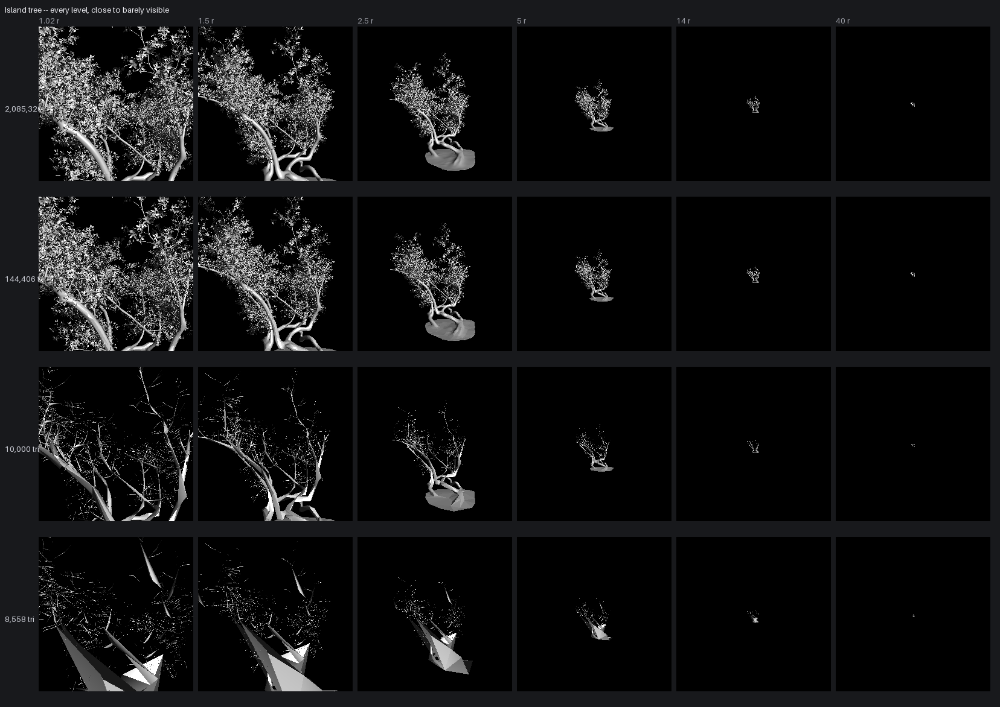

## Marble bust

Small enough to read every triangle, and a face is where an error is obvious.

| | |
|---|---|
| Source | 17,456 triangles, 9,746 vertices, 1 primitive |
| Welded to | 8,730 points |
| Reduced in | 0.0 s, 8,726 contractions |
| Peak process memory | 17096 MB, the loaded model included |
| Credit | 'Marble Bust 01' by Rico Cilliers, from [Poly Haven](https://polyhaven.com/a/marble_bust_01), CC0 |

| Level | Triangles | Of source | `result.error` | Measured | Replay | Draw | Frame rate | |
|---|---:|---:|---:|---:|---:|---:|---:|---|
| 0 | 17,456 | source | 0.00000 | -- | 17 ms | 0.04 ms | 25,708 | **walk up to it** |
| 1 | 13,212 | 75.7% | 0.00010 | 0.00044 | 13 ms | 0.04 ms | 25,511 |  |
| 2 | 10,000 | 57.3% | 0.00019 | 0.00050 | 10 ms | 0.04 ms | 25,888 | **a game's ordinary finest** |
| 3 | 4,784 | 27.4% | 0.00046 | 0.00115 | 5 ms | 0.04 ms | 25,168 |  |
| 4 | 2,288 | 13.1% | 0.00090 | 0.00297 | 3 ms | 0.04 ms | 25,662 |  |
| 5 | 1,094 | 6.3% | 0.00161 | 0.00468 | 2 ms | 0.04 ms | 26,158 |  |
| 6 | 524 | 3.0% | 0.00282 | 0.00940 | 1 ms | 0.04 ms | 26,083 |  |
| 7 | 250 | 1.4% | 0.00519 | 0.01318 | 1 ms | 0.04 ms | 24,057 |  |
| 8 | 120 | 0.69% | 0.00896 | 0.02660 | 1 ms | 0.04 ms | 24,214 | **past here, an imposter** |

### What it looks like

<table><tr><td align="center"><br><sub><b>17,456</b> tri<br>walk up to it</sub></td><td align="center"><br><sub><b>13,212</b> tri</sub></td><td align="center"><br><sub><b>10,000</b> tri<br>a game's ordinary finest</sub></td><td align="center"><br><sub><b>4,784</b> tri</sub></td><td align="center"><br><sub><b>2,288</b> tri</sub></td><td align="center"><br><sub><b>1,094</b> tri</sub></td><td align="center">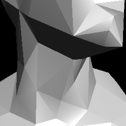<br><sub><b>524</b> tri</sub></td><td align="center">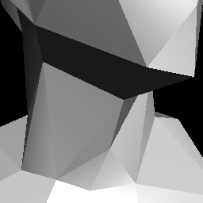<br><sub><b>250</b> tri</sub></td><td align="center">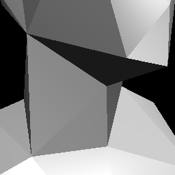<br><sub><b>120</b> tri<br>past here, an imposter</sub></td></tr></table>

<details><summary>and the triangles producing it</summary>

<table><tr><td align="center"><br><sub><b>17,456</b> tri<br>walk up to it</sub></td><td align="center"><br><sub><b>13,212</b> tri</sub></td><td align="center"><br><sub><b>10,000</b> tri<br>a game's ordinary finest</sub></td><td align="center"><br><sub><b>4,784</b> tri</sub></td><td align="center"><br><sub><b>2,288</b> tri</sub></td><td align="center"><br><sub><b>1,094</b> tri</sub></td><td align="center">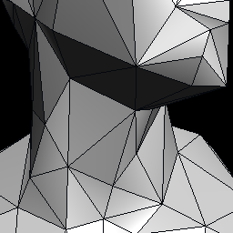<br><sub><b>524</b> tri</sub></td><td align="center">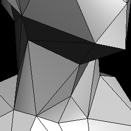<br><sub><b>250</b> tri</sub></td><td align="center">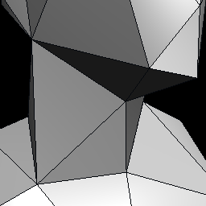<br><sub><b>120</b> tri<br>past here, an imposter</sub></td></tr></table>

</details>

### Close to barely visible

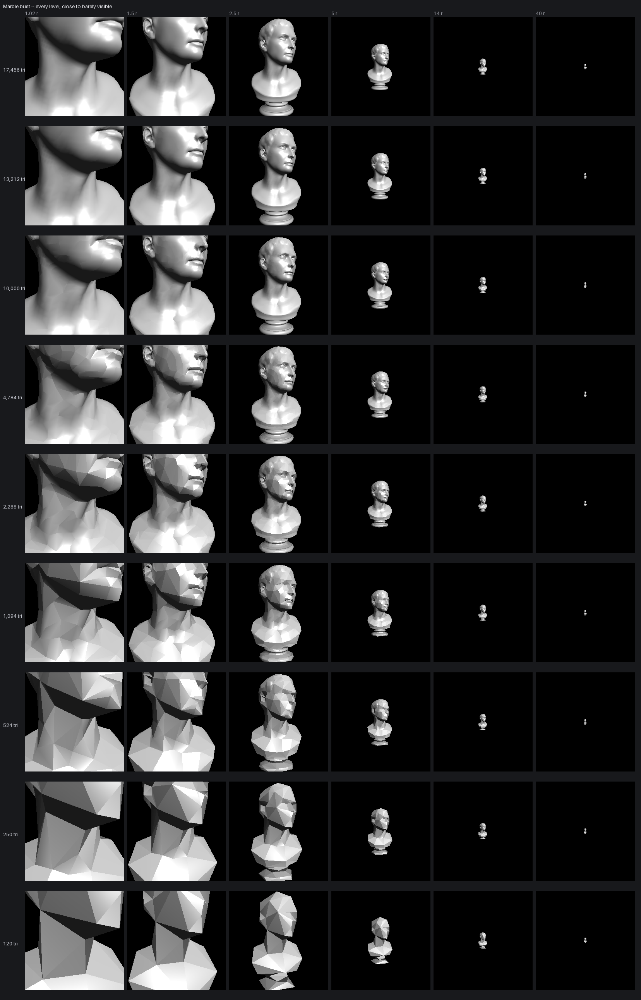

