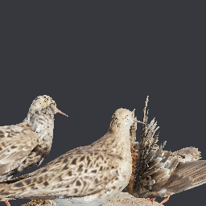
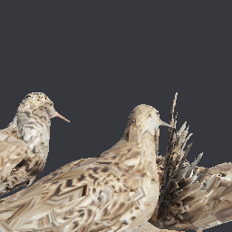

# What a reduction looks like

Every picture and every number on this page is written by [`tools/gallery.py`](../tools/gallery.py), so they describe the reducer as it stands rather than as it once was. Run it again after a change:

```bash
tools/gallery.py
```

Measured on <GLDescription Radeon 8060S Graphics (radeonsi, gfx1151, LLVM 20.1.2, DRM 3.64, 7.0.0-31-generic), 4.6 (Compatibility Profile) Mesa 25.2.8-0ubuntu0.24.04.2 (hardware)>. Reducing every subject took 16.9 GB of resident memory at its highest, against 1,537,926 triangles of coastal cliff -- the loaded model, its textures and the recorded sequence together.

Every subject is **CC0**. Credit is given because the work was given away.

- 'Coastal Cliff 04' by Rob Tuytel and Rico Cilliers, from [Poly Haven](https://polyhaven.com/a/coastal_cliff_04), CC0
- 'Lekking ruffs', inventory MP 045, from the Krystyna and Włodzimierz Tomek Natural Science Museum in Ciężkowice, Poland. Digitised by the Regional Digitalisation Lab, Małopolska Institute of Culture in Kraków, for the [Virtual Museums of Małopolska](https://muzea.malopolska.pl/en/objects-list/2250) project, CC0
- 'Coast Land Rocks 02' by Rob Tuytel and Rico Cilliers, from [Poly Haven](https://polyhaven.com/a/coast_land_rocks_02), CC0
- 'Marble Bust 01' by Rico Cilliers, from [Poly Haven](https://polyhaven.com/a/marble_bust_01), CC0

## How to read it

Each subject is decimated **once**. Every level below it is a prefix of that one recording replayed, which is why the reduction is counted in seconds and each level in milliseconds -- see [`collapse_sequence`](API.md#collapse_sequenceattributes-indices-optionsnone---collapsesequence).

The chain is the one a game would ship -- 32,000, 8,000, 4,000, 2,000, 1,000, 500 triangles -- rather than a share of whatever the scan happened to arrive with. What a renderer can afford is a count, not a proportion. The source sits above it as a reference: not a level anything would draw, but the picture the rest are judged against.

**Each level is drawn where a renderer would have chosen it.** The rule is screen-space error: a level is placed at the distance where its *measured* deviation from the source projects to **one pixel**, which is what a streaming renderer switches on. A length in model units says nothing about whether anyone can see it; a pixel does.

Three views of each level. **Close up** is the level with the model's own materials and textures, lit by a CC0 studio environment, at 0.25 radii -- the same distance for every level and for the source, so they can be compared with each other. **Where it is used** is the same level at the distance the rule above puts it, in the same frame: how small it is there is the answer, not an accident of framing. **Its triangles** is the level close up again, flat-shaded with its edges on, so what the decimation did is visible beside what it produced.

The **outline** and **shading** figures are the engine's own measurement of the swap where it is drawn: [`pop_breakdown`](../../openglcontext/OpenGLContext/meshlod/quality.py) splits the share of the object's pixels that change into the part whose outline moved and the part that merely shaded differently. The two want different remedies -- a moved outline needs triangles, changed shading needs a normal map baked from the fine mesh -- and one number for both would hide which is happening.

- **`result.error`** is the reducer's own figure: an area-weighted root-mean-square distance to the planes it has been through, not a bound.
- **Measured** is `certify.surface_deviation`, the sampled two-sided Hausdorff distance from the source surface -- the number a switching distance is built on. Both are in the model's own units.
- **Replay** is what `at()` cost to produce that level.
- **Draw** and **frame rate** are the level rendered into a 256 x 256 framebuffer with the geometry resident, timed with `glFinish` around each frame and reported as the median of 90. No swap and no compositor, so the number is what the triangles cost rather than what a monitor allowed. It is one object on an idle card: read the ratios between the rows, not the absolute rate.

Distances are in radii of the model's own bounding sphere, measured beyond its surface: 0.25 is close enough to fill the view, 32 is far enough that the object is a smudge.

## Coastal cliff

A photogrammetry scan of rock. There is no flat region to spend the first million triangles on and no symmetry to exploit: what the reduction keeps is silhouette.

| | |
|---|---|
| Source | 1,537,926 triangles, 789,032 vertices, 1 primitive over 1 material |
| Welded to | 771,255 points |
| Reduced in | 11.1 s, 771,249 contractions |
| Credit | 'Coastal Cliff 04' by Rob Tuytel and Rico Cilliers, from [Poly Haven](https://polyhaven.com/a/coastal_cliff_04), CC0 |

| Triangles | Of source | `result.error` | Measured | Replay | Draw | Frame rate | One pixel past | Outline | Shading |
|---:|---:|---:|---:|---:|---:|---:|---:|---:|---:|
| 1,537,926 *(the source, for reference)* | source | 0.00000 | -- | 2278 ms | 0.20 ms | 5,025 | -- | -- | -- |
| 32,000 *(the finest a game would ship)* | 2.1% | 0.04059 | 0.10510 | 146 ms | 0.04 ms | 24,478 | 0.0 r | 0.62% | 60.7% |
| 8,000 | 0.52% | 0.10042 | 0.21058 | 73 ms | 0.04 ms | 26,393 | 0.4 r | 1.37% | 68.6% |
| 4,000 | 0.26% | 0.15330 | 0.48983 | 56 ms | 0.04 ms | 24,711 | 2.4 r | 1.93% | 72.1% |
| 2,000 | 0.13% | 0.23028 | 0.68114 | 60 ms | 0.04 ms | 25,082 | 3.7 r | 3.23% | 74.9% |
| 999 | 0.06% | 0.34224 | 1.19127 | 56 ms | 0.04 ms | 24,460 | 7.2 r | 8.85% | 72.6% |
| 500 *(past here, an imposter)* | 0.03% | 0.49727 | 1.82888 | 46 ms | 0.04 ms | 26,661 | 11.6 r | 10.00% | 70.0% |

<table>
<tr><th align="left">Level</th><th align="left">Close up</th><th align="left">Where it is used</th><th align="left">Its triangles</th></tr>
<tr><td valign="top" width="140"><b>1,537,926</b> tri<br><sub><b>the source, for reference</b><br>the source, drawn where the finest level is</sub></td><td></td><td></td><td></td></tr>
<tr><td valign="top" width="140"><b>32,000</b> tri<br><sub><b>the finest a game would ship</b><br>one pixel of error past <b>0.0 radii</b><br>drawn there; outline 0.62%, shading 60.7%</sub></td><td></td><td></td><td></td></tr>
<tr><td valign="top" width="140"><b>8,000</b> tri<br><sub>one pixel of error past <b>0.4 radii</b><br>drawn there; outline 1.37%, shading 68.6%</sub></td><td></td><td></td><td></td></tr>
<tr><td valign="top" width="140"><b>4,000</b> tri<br><sub>one pixel of error past <b>2.4 radii</b><br>drawn there; outline 1.93%, shading 72.1%</sub></td><td></td><td></td><td></td></tr>
<tr><td valign="top" width="140"><b>2,000</b> tri<br><sub>one pixel of error past <b>3.7 radii</b><br>drawn there; outline 3.23%, shading 74.9%</sub></td><td></td><td></td><td></td></tr>
<tr><td valign="top" width="140"><b>999</b> tri<br><sub>one pixel of error past <b>7.2 radii</b><br>drawn there; outline 8.85%, shading 72.6%</sub></td><td></td><td></td><td></td></tr>
<tr><td valign="top" width="140"><b>500</b> tri<br><sub><b>past here, an imposter</b><br>one pixel of error past <b>11.6 radii</b><br>drawn there; outline 10.00%, shading 70.0%</sub></td><td></td><td></td><td></td></tr>
</table>

## Lekking ruffs

A museum scan exported as twenty-five primitives, each stopping at the 65,535 vertices a 16-bit index can name -- so the reduction sees one surface only because the primitives are merged and welded first. Nine of its thirteen components are specks the photogrammetry left behind, and `drop_components_below` takes them: 572 triangles.

The chain stops at 32,000 for a reason that belongs to the unwrap rather than to the reduction. An unwrap cuts the surface into islands and lays them flat on the image, duplicating the vertices along each cut -- so every vertex belongs to exactly one island, and a triangle samples the right part of the image only while all three of its corners are in the same one. A contraction across a cut leaves a triangle whose three coordinates point at three unrelated places in the atlas, and what it draws is the stripe between them.

This model is cut into 2,549 islands of 88 triangles apiece, so there is very little room before a triangle is bigger than an island. Counted: 17% of its triangles span more than one island at 32,000, 58% at 8,000 and 80% at 4,000 -- against 2% for the coastal cliff at 8,000 and 0.04% for the marble bust. What the birds wear below 32,000 is the ground they are standing on, because that is what is laid out next to them in the image. The geometry is unharmed and no option here helps: the fix is a coarser unwrap, which is a modelling job.

| | |
|---|---|
| Source | 547,647 triangles, 1,601,690 vertices, 25 primitives over 2 materials |
| Welded to | 273,414 points |
| Reduced in | 6.3 s, 271,735 contractions |
| Credit | 'Lekking ruffs', inventory MP 045, from the Krystyna and Włodzimierz Tomek Natural Science Museum in Ciężkowice, Poland. Digitised by the Regional Digitalisation Lab, Małopolska Institute of Culture in Kraków, for the [Virtual Museums of Małopolska](https://muzea.malopolska.pl/en/objects-list/2250) project, CC0 |

| Triangles | Of source | `result.error` | Measured | Replay | Draw | Frame rate | One pixel past | Outline | Shading |
|---:|---:|---:|---:|---:|---:|---:|---:|---:|---:|
| 547,075 *(the source, for reference)* | source | 0.00000 | -- | 939 ms | 0.24 ms | 4,158 | -- | -- | -- |
| 32,000 *(the last its texture describes)* | 5.8% | 0.00120 | 0.00542 | 114 ms | 0.07 ms | 13,485 | 3.3 r | 1.57% | 55.0% |

<table>
<tr><th align="left">Level</th><th align="left">Close up</th><th align="left">Where it is used</th><th align="left">Its triangles</th></tr>
<tr><td valign="top" width="140"><b>547,075</b> tri<br><sub><b>the source, for reference</b><br>the source, drawn where the finest level is</sub></td><td></td><td></td><td></td></tr>
<tr><td valign="top" width="140"><b>32,000</b> tri<br><sub><b>the last its texture describes</b><br>one pixel of error past <b>3.3 radii</b><br>drawn there; outline 1.57%, shading 55.0%</sub></td><td></td><td></td><td></td></tr>
</table>

## Coastal land rocks

Several separate boulders in one mesh, so the reduction has to spend across them.

| | |
|---|---|
| Source | 1,291,146 triangles, 662,707 vertices, 1 primitive over 1 material |
| Welded to | 647,007 points |
| Reduced in | 9.5 s, 646,979 contractions |
| Credit | 'Coast Land Rocks 02' by Rob Tuytel and Rico Cilliers, from [Poly Haven](https://polyhaven.com/a/coast_land_rocks_02), CC0 |

| Triangles | Of source | `result.error` | Measured | Replay | Draw | Frame rate | One pixel past | Outline | Shading |
|---:|---:|---:|---:|---:|---:|---:|---:|---:|---:|
| 1,291,146 *(the source, for reference)* | source | 0.00000 | -- | 2705 ms | 0.18 ms | 5,688 | -- | -- | -- |
| 32,000 *(the finest a game would ship)* | 2.5% | 0.00981 | 0.02428 | 109 ms | 0.05 ms | 21,219 | 0.4 r | 0.93% | 64.5% |
| 7,999 | 0.62% | 0.02303 | 0.05760 | 54 ms | 0.04 ms | 24,870 | 2.4 r | 3.51% | 70.6% |
| 3,999 | 0.31% | 0.03422 | 0.07442 | 44 ms | 0.04 ms | 26,176 | 3.4 r | 4.99% | 69.4% |
| 1,999 | 0.15% | 0.04964 | 0.13543 | 40 ms | 0.04 ms | 26,512 | 7.0 r | 9.57% | 69.9% |
| 999 | 0.08% | 0.07210 | 0.19508 | 38 ms | 0.05 ms | 22,125 | 10.5 r | 11.83% | 75.3% |
| 500 *(past here, an imposter)* | 0.04% | 0.10611 | 0.31521 | 37 ms | 0.04 ms | 24,261 | 17.5 r | 12.50% | 70.0% |

<table>
<tr><th align="left">Level</th><th align="left">Close up</th><th align="left">Where it is used</th><th align="left">Its triangles</th></tr>
<tr><td valign="top" width="140"><b>1,291,146</b> tri<br><sub><b>the source, for reference</b><br>the source, drawn where the finest level is</sub></td><td></td><td></td><td></td></tr>
<tr><td valign="top" width="140"><b>32,000</b> tri<br><sub><b>the finest a game would ship</b><br>one pixel of error past <b>0.4 radii</b><br>drawn there; outline 0.93%, shading 64.5%</sub></td><td></td><td></td><td></td></tr>
<tr><td valign="top" width="140"><b>7,999</b> tri<br><sub>one pixel of error past <b>2.4 radii</b><br>drawn there; outline 3.51%, shading 70.6%</sub></td><td></td><td></td><td></td></tr>
<tr><td valign="top" width="140"><b>3,999</b> tri<br><sub>one pixel of error past <b>3.4 radii</b><br>drawn there; outline 4.99%, shading 69.4%</sub></td><td></td><td></td><td></td></tr>
<tr><td valign="top" width="140"><b>1,999</b> tri<br><sub>one pixel of error past <b>7.0 radii</b><br>drawn there; outline 9.57%, shading 69.9%</sub></td><td></td><td></td><td></td></tr>
<tr><td valign="top" width="140"><b>999</b> tri<br><sub>one pixel of error past <b>10.5 radii</b><br>drawn there; outline 11.83%, shading 75.3%</sub></td><td></td><td></td><td></td></tr>
<tr><td valign="top" width="140"><b>500</b> tri<br><sub><b>past here, an imposter</b><br>one pixel of error past <b>17.5 radii</b><br>drawn there; outline 12.50%, shading 70.0%</sub></td><td></td><td></td><td></td></tr>
</table>

## Marble bust

Small enough to read every triangle, and a face is where an error is obvious.

| | |
|---|---|
| Source | 17,456 triangles, 9,746 vertices, 1 primitive over 1 material |
| Welded to | 8,730 points |
| Reduced in | 0.1 s, 8,726 contractions |
| Credit | 'Marble Bust 01' by Rico Cilliers, from [Poly Haven](https://polyhaven.com/a/marble_bust_01), CC0 |

| Triangles | Of source | `result.error` | Measured | Replay | Draw | Frame rate | One pixel past | Outline | Shading |
|---:|---:|---:|---:|---:|---:|---:|---:|---:|---:|
| 17,456 *(the source, for reference)* | source | 0.00000 | -- | 19 ms | 0.04 ms | 26,060 | -- | -- | -- |
| 8,000 *(the finest a game would ship)* | 45.8% | 0.00026 | 0.00074 | 14 ms | 0.04 ms | 24,775 | 0.0 r | 0.04% | 5.2% |
| 4,000 | 22.9% | 0.00055 | 0.00153 | 8 ms | 0.04 ms | 26,905 | 0.7 r | 0.24% | 15.9% |
| 2,000 | 11.5% | 0.00098 | 0.00427 | 4 ms | 0.04 ms | 25,928 | 3.8 r | 0.62% | 30.7% |
| 1,000 | 5.7% | 0.00172 | 0.00468 | 3 ms | 0.04 ms | 27,234 | 4.2 r | 1.51% | 45.8% |
| 500 *(past here, an imposter)* | 2.9% | 0.00292 | 0.00940 | 2 ms | 0.04 ms | 27,205 | 9.5 r | 1.92% | 53.3% |

<table>
<tr><th align="left">Level</th><th align="left">Close up</th><th align="left">Where it is used</th><th align="left">Its triangles</th></tr>
<tr><td valign="top" width="140"><b>17,456</b> tri<br><sub><b>the source, for reference</b><br>the source, drawn where the finest level is</sub></td><td></td><td></td><td></td></tr>
<tr><td valign="top" width="140"><b>8,000</b> tri<br><sub><b>the finest a game would ship</b><br>one pixel of error past <b>0.0 radii</b><br>drawn there; outline 0.04%, shading 5.2%</sub></td><td></td><td></td><td></td></tr>
<tr><td valign="top" width="140"><b>4,000</b> tri<br><sub>one pixel of error past <b>0.7 radii</b><br>drawn there; outline 0.24%, shading 15.9%</sub></td><td></td><td></td><td></td></tr>
<tr><td valign="top" width="140"><b>2,000</b> tri<br><sub>one pixel of error past <b>3.8 radii</b><br>drawn there; outline 0.62%, shading 30.7%</sub></td><td></td><td></td><td></td></tr>
<tr><td valign="top" width="140"><b>1,000</b> tri<br><sub>one pixel of error past <b>4.2 radii</b><br>drawn there; outline 1.51%, shading 45.8%</sub></td><td></td><td></td><td></td></tr>
<tr><td valign="top" width="140"><b>500</b> tri<br><sub><b>past here, an imposter</b><br>one pixel of error past <b>9.5 radii</b><br>drawn there; outline 1.92%, shading 53.3%</sub></td><td></td><td></td><td></td></tr>
</table>

## Where a chain stops

Some subjects above run out of ladder before they run out of rungs. A reduction stops where no contraction is left that keeps the surface a surface, and three properties of the *model* decide where that is. `opengl_decimate.survey` measures all three off any mesh, before a reduction is spent on it.

**Pieces.** Every connected piece reduces on its own and each has a floor of its own -- a closed shell cannot go below four triangles -- so a scan that arrived with the subject and two hundred crumbs spends four triangles on each crumb however coarse a target it is given. `drop_components_below` takes the pieces smaller than a given share of the model's diagonal, and never the largest.

**Handles.** A tunnel through the surface cannot be closed at all. Contracting an edge under the link condition preserves topology by construction -- that is what the condition is for -- so every handle survives to the end and costs the triangles it takes to go round it. A scan of feathers, foliage or lace arrives with hundreds, and no option in this package will remove one: closing a tunnel is a different operation from contracting an edge.

**The atlas.** A texture coordinate means something only inside one chart -- one connected piece of surface that was unwrapped as one -- so a triangle covering more surface than a chart holds has no coordinate that fits it. The reduction still runs, and what it draws is a smear of whatever the atlas holds nearby. `survey` reports the count and the **texture floor** it implies, and that floor is a property of how the model was unwrapped rather than of the reducer: no option here moves it, and re-cutting the atlas is what does. How visible that is depends on how much of the model the small charts cover: an atlas of a few large charts and a handful of small ones loses only the handful, which is why the cliff and the rocks still read below the floor quoted for them. An atlas whose charts are *uniformly* small has nowhere to hide, and that is the case worth measuring for.

The lekking ruffs is the subject on this page that runs into it: 405,540 triangles across 2,549 charts, a median of 88 triangles each, which puts its floor at 15,020. Its ladder stops at 32,000 for that reason and not for any the reduction has -- at 8,000 the geometry is still a fair bird and the texture on it is the ground.

| Subject | Pieces | Handles | Atlas charts | Texture floor | Floor |
|---|---:|---:|---:|---:|---:|
| Coastal cliff | 3 | 1 | 143 | 1,405 tri | reached the bottom of the chain |
| Lekking ruffs | 4 | 201 | 2,549 | 15,020 tri | 32,000 tri, past which it samples across its atlas |
| Coastal land rocks | 1 | 5 | 186 | 4,611 tri | reached the bottom of the chain |
| Marble bust | 1 | 0 | 24 | 49 tri | reached the bottom of the chain |

## What this box is

The draw times and frame rates above are one machine. It is a fast one, and a reader sizing a budget for players should read the *ratios* between the rows rather than the absolute numbers: what a level costs relative to the one above it is a property of the triangles, and it carries across hardware. The rate does not.

Where a GPU is fast enough, per-triangle cost stops being what the frame is made of: below some count the draw is bounded by fixed per-call work and the times flatten out, so the coarsest rungs look free. On an integrated part, or a phone, they are not -- the curve keeps falling, and the rungs this page shows as indistinguishable are the difference between a frame and a stutter. Size a chain against the slowest machine meant to draw it.

